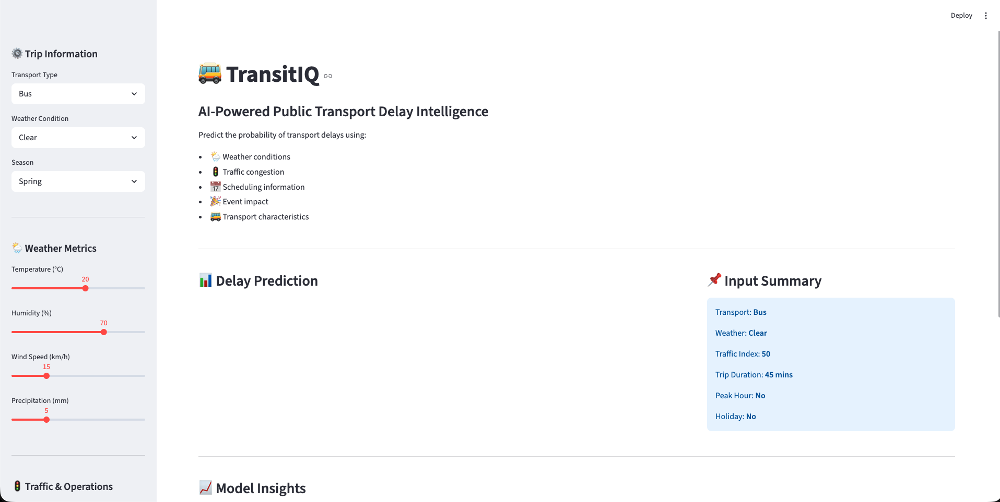
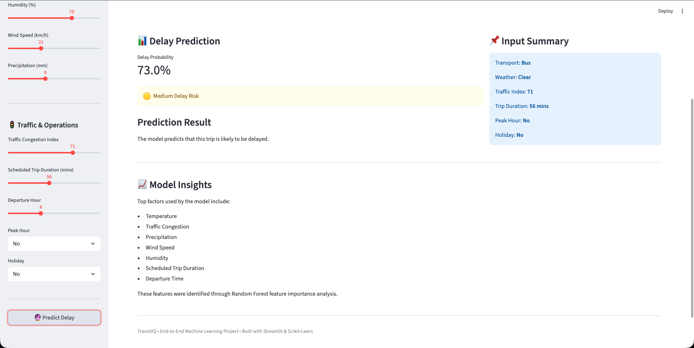

<div align="center">

# 🚌 TransitIQ

### AI-Powered Public Transport Delay Intelligence

Predict transit delays using weather, traffic, and operational signals.

[]()
[]()
[]()

</div>

---

## ✨ Overview

TransitIQ is an end-to-end machine learning project that predicts the likelihood of public transport delays using weather conditions, traffic congestion, scheduling information, and operational factors.

The project covers the complete ML workflow:

- Data auditing
- Exploratory Data Analysis (EDA)
- Feature engineering
- Model training
- Model evaluation
- Model deployment
- Interactive Streamlit application

---

## 📸 Application Preview

### Home Screen



### Prediction Result



---

## 🎯 Problem Statement

Transit delays affect millions of commuters every day.

The objective of TransitIQ is to estimate the probability that a transit trip will be delayed based on environmental and operational conditions before the journey begins.

---

## 🧠 Machine Learning Pipeline

```text
Raw Dataset
    ↓
Data Audit
    ↓
EDA
    ↓
Feature Engineering
    ↓
Train/Test Split
    ↓
Model Training
    ↓
Model Evaluation
    ↓
Model Persistence
    ↓
Streamlit Deployment
```

---

## 🗂️ Project Structure

```text
transit-iq/
│
├── app/
│   └── app.py
│
├── assets/
│   ├── home.png
│   └── prediction.png
│
├── data/
│
├── models/
│   └── transit_iq_classifier.pkl
│
├── notebooks/
│   ├── 01_data_audit.ipynb
│   ├── 02_eda.ipynb
│   ├── 03_feature_engineering.ipynb
│   └── 04_classification_modeling.ipynb
│
├── src/
│
├── requirements.txt
│
└── README.md
```

---

## 🔧 Tech Stack

### Data Science

- Pandas
- NumPy
- Matplotlib
- Seaborn

### Machine Learning

- Scikit-Learn
- Random Forest Classifier
- Logistic Regression

### Deployment

- Streamlit

### Model Persistence

- Joblib

---

## 📊 Model Performance

### Classification Results

| Model | Accuracy | Precision | Recall | F1 Score | ROC-AUC |
|---------|---------|---------|---------|---------|---------|
| Logistic Regression | 73.5% | 74.9% | 97.3% | 84.6% | 0.446 |
| Random Forest | 75.0% | 75.0% | 100% | 85.7% | 0.481 |

---

## 🔍 Key Insights

### Feature Importance

The model relied most heavily on:

- Temperature
- Traffic Congestion Index
- Precipitation
- Wind Speed
- Humidity
- Scheduled Trip Duration

### Dataset Findings

- Weather variables showed the strongest influence.
- Scheduling variables contributed moderately.
- Delay prediction signal was relatively weak across all tested models.
- Multiple algorithms produced similar performance patterns.

---

## 🚀 Run Locally

Clone the repository:

```bash
git clone https://github.com/manasscodes/transit-iq.git
```

Enter project directory:

```bash
cd transit-iq
```

Install dependencies:

```bash
pip install -r requirements.txt
```

Launch application:

```bash
streamlit run app/app.py
```

---

## 🎓 Learning Outcomes

Through this project I practiced:

- End-to-end ML workflows
- Data preprocessing
- Feature engineering
- Classification modeling
- Model evaluation
- Pipeline construction
- Model serialization
- Streamlit deployment
- Git & GitHub project management

---

## 🔮 Future Improvements

- Real-time weather API integration
- Live traffic intelligence
- Route-specific forecasting
- Explainable AI with SHAP
- FastAPI inference endpoint
- Production deployment pipeline

---

## 👨‍💻 Author

**Manas Kolaskar**

GitHub: https://github.com/manasscodes

---

⭐ If you found this project interesting, consider starring the repository.